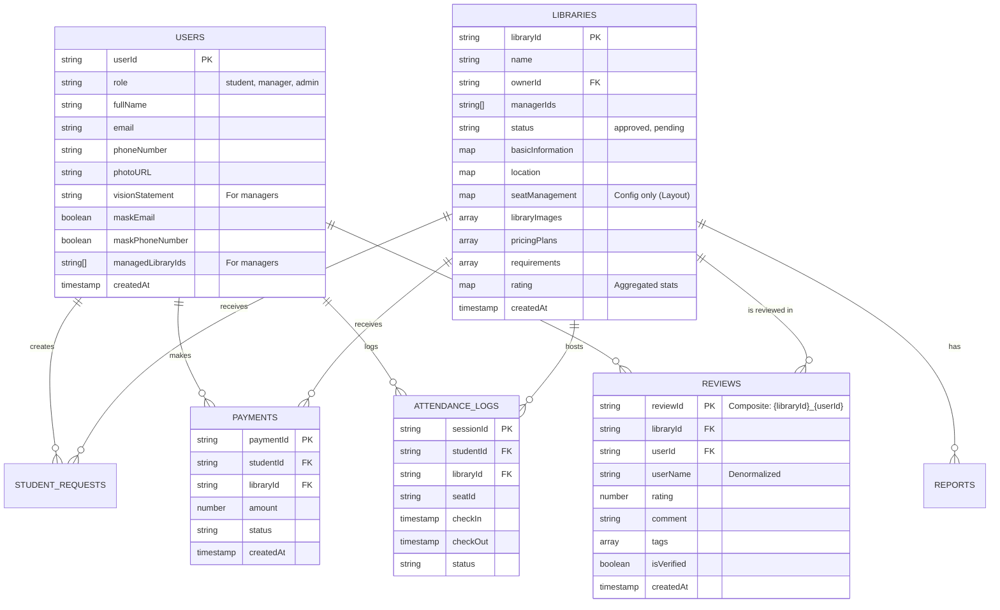

# Ekaant — ER Diagram & Schema Visualization (v2.2 - Hybrid Architecture)

This document outlines the **Hybrid Firestore + Realtime Database (RTDB)** architecture. This approach optimizes for cost and performance by separating high-frequency state updates (RTDB) from structured historical records (Firestore).

## 1. Architecture Philosophy

*   **Realtime Database (The "Now"):** Handles the *current* state of the world.
    *   **Use Cases:** Live Seat Map, User Presence, Check-in/out Action Queue.
    *   **Benefit:** Low latency, cheap bandwidth for frequent small updates (e.g., seat status toggling).
*   **Firestore (The "Record"):** Handles the *identity* and *history* of the world.
    *   **Use Cases:** User Profiles, Library Metadata, Payment History, Reviews.
    *   **Benefit:** Strong querying capabilities, relational structure, strict security rules.

## 2. Entity Relationship Diagram (Firestore)



## 3. Realtime Database (RTDB) Schema

The RTDB is structured as a JSON tree.

```json
{
  "libraries": {
    "LIB001": {
      // Live Seat Status (Public Read / System Write)
      "live_seats": {
        "s1": { "status": "occupied", "user_hash": "...", "since": 1732000000 },
        "s2": { "status": "available" },
        "s3": { "status": "maintenance" }
      },
      
      // Aggregate Live Stats (Public Read / System Write)
      "live_stats": {
        "occupied_count": 45,
        "total_seats": 50,
        "is_full": false
      },

      // Action Queue (Student Write / System Read)
      // Students push requests here; Cloud Functions listen, validate, and process.
      "actions": {
        "req_abc123": {
          "type": "check_in",
          "studentId": "UID_123",
          "seatId": "s5",
          "timestamp": 1732000050
        }
      }
    }
  },

  "users": {
    "UID_123": {
      // User Presence & Current Session
      "presence": {
        "state": "online", 
        "last_seen": 1732000050,
        "current_session": {
          "libraryId": "LIB001",
          "seatId": "s1",
          "status": "active"
        }
      }
    }
  }
}
```

## 4. Firestore Document Structures (Detailed)

### `LIBRARIES` (Approved) & `LIBRARY_REGISTRATIONS` (Pending)

Both collections share the `ILibrary` interface structure. `library-registrations` is used for the approval workflow and change management.

```json
{
  "id": "LIB001",
  "status": "approved",
  "ownerId": "UID_MANAGER",
  "managerIds": ["UID_MANAGER"],
  "basicInformation": {
    "libraryName": "Central Library",
    "addressLine1": "123 Main St",
    "city": "Ranchi",
    "state": "Jharkhand",
    "zipCode": "834001",
    "genderCategory": "Co-ed",
    "operatingHoursStart": "06:00",
    "operatingHoursEnd": "22:00"
  },
  "seatManagement": {
    "totalSeats": 50,
    "occupiedSeats": 0, // Synced from RTDB for initial load
    "seats": [
        { "id": "s1", "seatNumber": "1", "hasPower": true, "isAC": true, "status": "active" }
    ]
  },
  "pricingPlans": [
    { "planName": "Daily", "rate": 50, "type": "PayPerUse", "unit": "day" }
  ],
  "libraryImages": [
    { "imageURL": "https://...", "caption": "Reading Hall", "order": 0 }
  ],
  "requirements": [
    { "name": "ID Proof", "description": "Aadhar Card" }
  ],
  "amenities": ["wifi", "ac", "water"], // Simple array of keys for filtering
  "rating": {
    "averageRating": 4.5,
    "totalReviews": 120,
    "breakdown": [{ "stars": 5, "count": 100 }]
  }
}
```

### `REVIEWS` (Sub-collection)

Path: `libraries/{libraryId}/reviews/{reviewId}`

```json
{
  "reviewId": "LIB001_UID123",
  "userId": "UID123",
  "userName": "Sandeep Kumar",
  "rating": 5,
  "comment": "Great place!",
  "isVerified": true,
  "tags": [
    { "text": "Quiet", "type": "positive" }
  ],
  "timestamp": "2025-11-28T10:00:00Z"
}
```

## 5. Workflows

### The "Update" Workflow (Change Management)
1.  Manager requests an edit on an active library (`libraries/LIB001`).
2.  System creates/updates a document in `library-registrations` with the current data and `applicationStatus: 'pending'`.
3.  Manager makes edits to the draft in `library-registrations`.
4.  Admin reviews and approves.
5.  **Cloud Function** copies data from `library-registrations` -> `libraries/LIB001`.

### The Check-In Flow (Hybrid)
1.  **Student** scans QR code.
2.  **App** writes `{ type: 'check_in', seat: '5' }` to RTDB `libraries/{id}/actions`.
3.  **Cloud Function** triggers:
    *   Validates user and seat availability.
    *   Updates RTDB `live_seats/5` to `occupied`.
    *   Creates Firestore `ATTENDANCE_LOGS` entry.
    *   Updates User Presence in RTDB.

## 6. Indexing Strategy

*   **`libraries`**:
    *   `location.city` + `status`
    *   `amenities` (array-contains) + `status`
    *   `managerIds` (array-contains)
*   **`reviews`**:
    *   `libraryId` + `timestamp` (DESC)