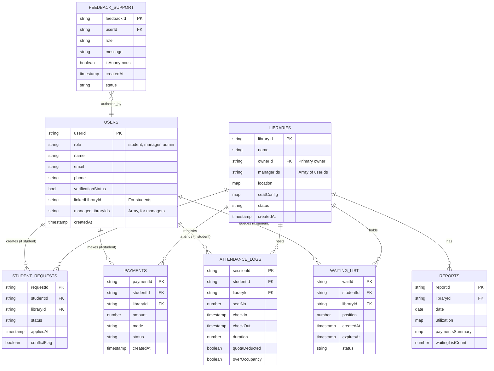
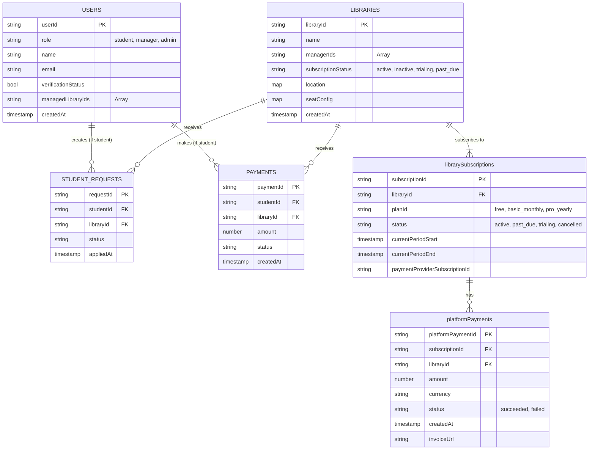

# Ekaant — ER Diagram & Schema Visualization (v2)

Below is the updated ER-style diagram (Mermaid) of the Firestore schema. This version incorporates feedback to support multiple managers per library and to prepare for managers overseeing multiple libraries in the future.



---

## Notes & Index Recommendations

*   **Composite Indexes**:
    *   `libraries` by `location.pincode` and `status`.
    *   `libraries` by `managerIds` (array-contains query).
    *   `student_requests` composite index: `libraryId, status, appliedAt`.
    *   `waiting_list` composite index: `libraryId, status, createdAt`.
    *   `attendance_logs` composite: `libraryId, checkIn (desc)`.
    *   `payments` composite: `libraryId, status, createdAt`.

*   **TTL / Cleanup:** Use `expiresAt` on `waiting_list` and a scheduled Cloud Function to remove expired entries.

*   **Denormalization Tips:**
    *   Store `studentName`, `studentPhone` inside `student_requests` & `waiting_list` to avoid extra reads when rendering manager dashboards.
    *   Store `libraryName` and `libraryLogoUrl` inside `payments` and `attendance_logs` for quicker reporting.

---

## Sample Document (student user)

```json
{
  "userId": "UID123",
  "role": "student",
  "name": "Sandeep Kumar",
  "email": "sandeep@example.com",
  "phone": "+919999999999",
  "verificationStatus": true,
  "linkedLibraryId": "LIB001",
  "managedLibraryIds": null,
  "createdAt": "2025-11-04T00:00:00Z"
}
```

## Sample Document (manager user)

```json
{
  "userId": "UID999",
  "role": "manager",
  "name": "Aarav Patel",
  "email": "manager@example.com",
  "phone": "+918888888888",
  "verificationStatus": true,
  "linkedLibraryId": null,
  "managedLibraryIds": ["LIB001"],
  "createdAt": "2025-11-01T00:00:00Z"
}
```

## Sample Document (library)

```json
{
  "libraryId": "LIB001",
  "name": "Ranchi Study Hub",
  "ownerId": "UID999",
  "managerIds": ["UID999", "UID998"],
  "location": {"city":"Ranchi","pincode":"834001","mapUrl":"..."},
  "seatConfig": {"totalSeats":50,"slots":[{"slotType":"4hr","price":40}]},
  "status":"approved",
  "createdAt":"2025-11-01T00:00:00Z"
}
```
--- 

### Feature Spotlight: Registration Comments

This section details the implementation of the real-time commenting feature used during the library registration approval process.

#### 1. User Story

*   **As an Admin**, I want to leave comments and ask questions about a library's application directly on the review page so I can communicate requirements clearly.
*   **As a Library Manager**, I want to see the admin's comments and reply to them on my application status page so I can resolve issues quickly.
*   **As both**, I want the conversation to be real-time without needing to refresh the page.

#### 2. Data Structure

Comments are stored in a sub-collection within each library registration document to ensure data is co-located and easy to query.

*   **Collection:** `library-registrations`
    *   **Document:** `{registrationId}`
        *   **Sub-collection:** `comments`
            *   **Document:** `{commentId}` (auto-generated)
                *   `message`: `string` - The content of the comment.
                *   `role`: `string` ('admin' or 'manager') - The role of the user who left the comment.
                *   `uid`: `string` - The Firebase Auth UID of the user.
                *   `timestamp`: `Timestamp` - The server-side timestamp for chronological ordering.

**Sample Comment Document:**
```json
// /library-registrations/REG123/comments/CMT456
{
  "message": "Please upload a clearer picture of the entrance.",
  "role": "admin",
  "uid": "ADMIN_USER_UID",
  "timestamp": "2025-11-25T10:00:00Z"
}
```

#### 3. Frontend Implementation (Angular)

The logic is encapsulated within the client-side application using Angular and `@angular/fire`.

*   **`ApprovalCommentsComponent`:** A reusable UI component responsible for displaying the comment thread and the input form. It is used in both the admin's `library-request-detail` page and the manager's `application-status` page.
*   **`LibraryService`:** This service contains the methods for interacting with Firestore.
    *   `getComments(registrationId)`: Uses `collectionData` from `@angular/fire` to get a real-time `Observable` of the comments sub-collection, ordered by `timestamp`.
    *   `addComment(registrationId, comment)`: Uses `addDoc` to create a new document in the `comments` sub-collection, adding a `serverTimestamp()` to the payload.

#### 4. Backend Implementation

No dedicated Cloud Functions are required for the core commenting feature. The real-time nature of Firestore is leveraged directly by the client.

#### 5. Security Rules (`firestore.rules`)

Security is enforced via Firestore rules to ensure that only authorized users can participate in the conversation.

```
match /library-registrations/{regId} {
  // Allow read/write for the manager who owns the application and any admin.
  // (Simplified rule - actual rule would check ownerId on the document)
  allow read, write: if request.auth.uid == resource.data.ownerId || get(/databases/$(database)/documents/users/$(request.auth.uid)).data.role == 'admin';

  match /comments/{commentId} {
    // Allow list (read) for the manager and admins
    allow list: if request.auth.uid == get(/databases/$(database)/documents/library-registrations/$(regId)).data.ownerId
                  || get(/databases/$(database)/documents/users/$(request.auth.uid)).data.role == 'admin';

    // Allow get (read single) for the manager and admins
    allow get: if request.auth.uid == get(/databases/$(database)/documents/library-registrations/$(regId)).data.ownerId
                 || get(/databases/$(database)/documents/users/$(request.auth.uid)).data.role == 'admin';

    // Allow create (write) for the manager and admins, but validate their role in the written data.
    allow create: if (request.auth.uid == get(/databases/$(database)/documents/library-registrations/$(regId)).data.ownerId
                     && request.resource.data.role == 'manager')
                    || (get(/databases/$(database)/documents/users/$(request.auth.uid)).data.role == 'admin'
                        && request.resource.data.role == 'admin');
  }
}
```
*Note: The security rules are illustrative. The actual implementation should be carefully tested.*

---
# Brainstorming: B2B SaaS Pricing Model Integration (v3)

This section details the necessary data structure changes to incorporate a SaaS pricing model for libraries.

### 1. Current Model Analysis

*   **Student Payments (B2C):** The current `PAYMENTS` collection tracks payments from a **student** to a **library**. This is well-defined.
*   **Library Subscription (B2B - SaaS):** The core gap is modeling how a **library** pays **Ekaant** for using the platform. The `LIBRARIES` collection lacks fields for subscription plan, status, or payment history.

### 2. Proposed ER Diagram & Schema Changes (v3)

To properly integrate the SaaS pricing model, we will add two new collections and denormalize a status field into the `LIBRARIES` collection.

#### New Collections:

1.  **`librarySubscriptions`**: Manages the subscription lifecycle for each library.
2.  **`platformPayments`**: Logs all subscription payments made by a library to Ekaant.

#### Updated `LIBRARIES` Collection:

*   Add a `subscriptionStatus` field for quick, performant checks on a library's active status.

Here is the proposed **v3 ER Diagram**:


