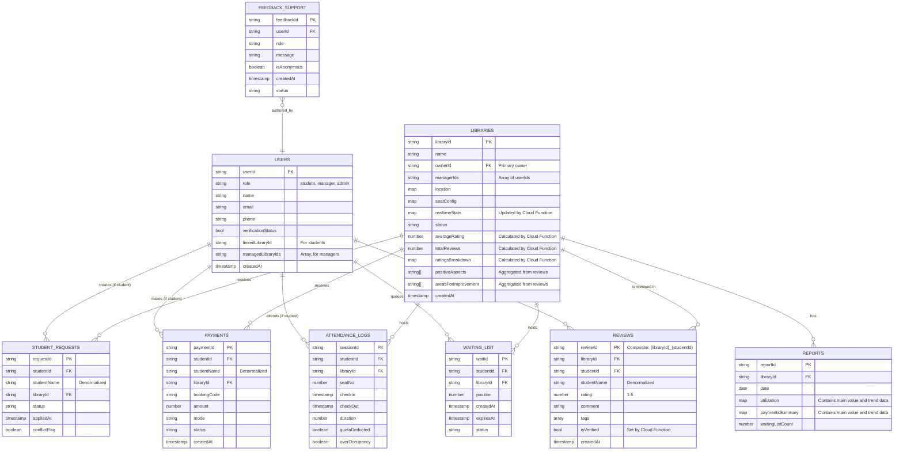

# Ekaant — ER Diagram & Schema Visualization (v2.1 - With Reviews)

Below is the updated ER-style diagram (Mermaid) of the Firestore schema. This version incorporates a new `REVIEWS` collection and denormalized aggregate data into the `LIBRARIES` collection to efficiently handle user ratings and reviews.



---

## Notes & Index Recommendations

*   **Real-time Dashboard Data:**
    *   The `LIBRARIES.realtimeStats` map is updated by a Cloud Function that triggers on changes to `ATTENDANCE_LOGS`.

*   **Rating Aggregation (Cloud Function):**
    *   A Cloud Function (`onReviewChange`) triggers whenever a document in the `REVIEWS` collection is created, updated, or deleted.
    *   This function performs an aggregation query on the `REVIEWS` collection for the specific `libraryId`.
    *   It calculates the new `averageRating`, `totalReviews`, `ratingsBreakdown` map, and aggregates the top positive/negative tags.
    *   It then updates these fields in the corresponding `LIBRARIES` document. This ensures that the library details page can load all rating information with a single document read, making it highly performant.

*   **Denormalization for UI Performance:**
    *   `studentName` is denormalized into `STUDENT_REQUESTS`, `PAYMENTS`, `WAITING_LIST`, and `REVIEWS`.
    *   `libraryName` and `libraryLogoUrl` are denormalized into `PAYMENTS` and `ATTENDANCE_LOGS`.

*   **Aggregate Data Reporting:**
    *   The `REPORTS` collection is populated by a scheduled Cloud Function for fast dashboard loading.

*   **Composite Indexes**:
    *   `libraries` by `location.pincode` and `status`.
    *   `libraries` by `managerIds` (array-contains query).
    *   `student_requests` composite index: `libraryId, status, appliedAt`.
    *   `waiting_list` composite index: `libraryId, status, createdAt`.
    *   `attendance_logs` composite: `libraryId, checkIn (desc)`.
    *   `payments` composite: `libraryId, status, createdAt`.
    *   **`reviews` composite: `libraryId, createdAt (desc)`.**

*   **TTL / Cleanup:** Use `expiresAt` on `waiting_list` for cleanup.

---

## Sample Documents

**Sample Document (library)**
```json
{
  "libraryId": "LIB001",
  "name": "Ranchi Study Hub",
  "ownerId": "UID999",
  "managerIds": ["UID999", "UID998"],
  "location": {"city":"Ranchi","pincode":"834001","mapUrl":"..."},
  "seatConfig": {"totalSeats":50,"slots":[{"slotType":"4hr","price":40}]},
  "realtimeStats": {"occupiedSeats": 12, "availableSeats": 38},
  "status":"approved",
  "averageRating": 4.5,
  "totalReviews": 128,
  "ratingsBreakdown": { "5": 78, "4": 32, "3": 12, "2": 4, "1": 2 },
  "positiveAspects": ["Fast Wi-Fi", "Cleanliness", "Quiet Atmosphere"],
  "areasForImprovement": ["Crowded", "AC Issues"],
  "createdAt":"2025-11-01T00:00:00Z"
}
```

**Sample Document (review)**
```json
// Document ID: LIB001_UID123
{
  "reviewId": "LIB001_UID123",
  "libraryId": "LIB001",
  "studentId": "UID123",
  "studentName": "Priya Sharma",
  "rating": 5,
  "comment": "Excellent facilities and very clean environment. The Wi-Fi is super fast!",
  "tags": [
    { "text": "Cleanliness", "type": "positive" },
    { "text": "Fast Wi-Fi", "type": "positive" }
  ],
  "isVerified": true,
  "createdAt": "2025-11-26T14:30:00Z"
}
```

**Sample Document (student user)**

```json
{
  "userId": "UID123",
  "role": "student",
  "name": "Sandeep Kumar",
  "email": "sandeep@example.com",
  "phone": "+919999999999",
  "verificationStatus": true,
  "linkedLibraryId": "LIB001",
  "managedLibraryIds": null,
  "createdAt": "2025-11-04T00:00:00Z"
}
```

**Sample Document (manager user)**

```json
{
  "userId": "UID999",
  "role": "manager",
  "name": "Aarav Patel",
  "email": "manager@example.com",
  "phone": "+918888888888",
  "verificationStatus": true,
  "linkedLibraryId": null,
  "managedLibraryIds": ["LIB001"],
  "createdAt": "2025-11-01T00:00:00Z"
}
```

**Sample Document (payment)**

```json
{
  "paymentId": "PAY789",
  "studentId": "UID123",
  "studentName": "Sandeep Kumar",
  "libraryId": "LIB001",
  "bookingCode": "EKA-RSH-00124",
  "amount": 1200,
  "mode": "Cash",
  "status": "paid",
  "createdAt": "2025-11-28T10:00:00Z"
}
```
--- 

### Feature Spotlight: Ratings & Reviews

This section provides a deep-dive into the review system's architecture, logic, and security.

#### 1. Core Logic & User Flow

1.  **One Review Per Student, Per Library**: To maintain authenticity, a student can only submit one review for any given library.
    *   **Implementation**: We enforce this by creating a composite **Document ID** for each review using the format `{libraryId}_{studentId}`.
    *   **User Experience**: When a student who has already left a review attempts to write another, the UI will present them with their existing review in an "edit" mode instead of a "create" mode.

2.  **Verified Reviews**: To combat fake or paid reviews, we mark reviews as "verified" only if the student is a legitimate member of the library.
    *   **Implementation**: The `isVerified` flag on a `REVIEWS` document is set by a Cloud Function. When a review is written, the function checks if the `studentId` has an `approved` application in `STUDENT_REQUESTS` or a recent `PAYMENTS` record for that `libraryId`.
    *   **User Experience**: Verified reviews are given more prominence in the UI, potentially with a distinct badge.

3.  **Review Tags**: Users can add descriptive tags (e.g., "Cleanliness", "Crowded") to their reviews, similar to the Google Play Store.
    *   **Implementation**: The `REVIEWS` document contains a `tags` array. Each tag is an object with `text` and `type` ('positive' or 'negative').
    *   **Aggregation**: The `onReviewChange` Cloud Function will also aggregate the most frequently mentioned tags and update the `positiveAspects` and `areasForImprovement` arrays in the main `LIBRARIES` document.

#### 2. Backend Implementation (`onReviewChange` Cloud Function)

A single Cloud Function, `onReviewChange`, handles all rating and review aggregation. It is triggered by `onCreate`, `onUpdate`, and `onDelete` events in the `REVIEWS` collection.

*   **Trigger**: `functions.firestore.document('reviews/{reviewId}')`
*   **Process**:
    1.  Get the `libraryId` from the changed document.
    2.  Query all documents in the `REVIEWS` collection where `libraryId` matches.
    3.  **Recalculate**:
        *   `totalReviews`: The count of all documents.
        *   `averageRating`: The average of the `rating` field across all documents.
        *   `ratingsBreakdown`: A map counting the occurrences of each star rating (1 through 5).
        *   `positiveAspects` / `areasForImprovement`: Count occurrences of each tag and take the top 3-5 for each category.
    4.  **Update**: Write the aggregated data back to the corresponding document in the `LIBRARIES` collection.

#### 3. Security Rules (`firestore.rules`)

Security rules are critical to ensure data integrity and prevent abuse.

```
match /reviews/{reviewId} {
    //
    // RULE: A user can only review a library once.
    // The documentId must be a composite of libraryId and the user's own ID.
    // On create, this prevents a user from creating a second review for the same library.
    //
    allow create: if request.auth.uid == request.resource.data.studentId
                  && reviewId == request.resource.data.libraryId + '_' + request.auth.uid
                  && isVerifiedMember(request.resource.data.libraryId, request.auth.uid);

    //
    // RULE: A user can only update their own review.
    //
    allow update: if request.auth.uid == resource.data.studentId;

    //
    // RULE: Anyone can read reviews.
    //
    allow get, list: if true;

    // Helper function to check for library membership.
    // (This is a simplified example; actual implementation might be more complex)
    function isVerifiedMember(libraryId, userId) {
      return exists(/databases/$(database)/documents/student_requests/$(libraryId + '_' + userId))
             && get(/databases/$(database)/documents/student_requests/$(libraryId + '_' + userId)).data.status == 'approved';
    }
}
```

### Feature Spotlight: Registration Comments

This section details the implementation of the real-time commenting feature used during the library registration approval process.

#### 1. User Story

*   **As an Admin**, I want to leave comments and ask questions about a library's application directly on the review page so I can communicate requirements clearly.
*   **As a Library Manager**, I want to see the admin's comments and reply to them on my application status page so I can resolve issues quickly.
*   **As both**, I want the conversation to be real-time without needing to refresh the page.

#### 2. Data Structure

Comments are stored in a sub-collection within each library registration document to ensure data is co-located and easy to query.

*   **Collection:** `library-registrations`
    *   **Document:** `{registrationId}`
        *   **Sub-collection:** `comments`
            *   **Document:** `{commentId}` (auto-generated)
                *   `message`: `string` - The content of the comment.
                *   `role`: `string` ('admin' or 'manager') - The role of the user who left the comment.
                *   `uid`: `string` - The Firebase Auth UID of the user.
                *   `timestamp`: `Timestamp` - The server-side timestamp for chronological ordering.

**Sample Comment Document:**
```json
// /library-registrations/REG123/comments/CMT456
{
  "message": "Please upload a clearer picture of the entrance.",
  "role": "admin",
  "uid": "ADMIN_USER_UID",
  "timestamp": "2025-11-25T10:00:00Z"
}
```

#### 3. Frontend Implementation (Angular)

The logic is encapsulated within the client-side application using Angular and `@angular/fire`.

*   **`ApprovalCommentsComponent`:** A reusable UI component responsible for displaying the comment thread and the input form. It is used in both the admin's `library-request-detail` page and the manager's `application-status` page.
*   **`LibraryService`:** This service contains the methods for interacting with Firestore.
    *   `getComments(registrationId)`: Uses `collectionData` from `@angular/fire` to get a real-time `Observable` of the comments sub-collection, ordered by `timestamp`.
    *   `addComment(registrationId, comment)`: Uses `addDoc` to create a new document in the `comments` sub-collection, adding a `serverTimestamp()` to the payload.

#### 4. Backend Implementation

No dedicated Cloud Functions are required for the core commenting feature. The real-time nature of Firestore is leveraged directly by the client.

#### 5. Security Rules (`firestore.rules`)

Security is enforced via Firestore rules to ensure that only authorized users can participate in the conversation.

```
match /library-registrations/{regId} {
  // Allow read/write for the manager who owns the application and any admin.
  // (Simplified rule - actual rule would check ownerId on the document)
  allow read, write: if request.auth.uid == resource.data.ownerId || get(/databases/$(database)/documents/users/$(request.auth.uid)).data.role == 'admin';

  match /comments/{commentId} {
    // Allow list (read) for the manager and admins
    allow list: if request.auth.uid == get(/databases/$(database)/documents/library-registrations/$(regId)).data.ownerId
                  || get(/databases/$(database)/documents/users/$(request.auth.uid)).data.role == 'admin';

    // Allow get (read single) for the manager and admins
    allow get: if request.auth.uid == get(/databases/$(database)/documents/library-registrations/$(regId)).data.ownerId
                 || get(/databases/$(database)/documents/users/$(request.auth.uid)).data.role == 'admin';

    // Allow create (write) for the manager and admins, but validate their role in the written data.
    allow create: if (request.auth.uid == get(/databases/$(database)/documents/library-registrations/$(regId)).data.ownerId
                     && request.resource.data.role == 'manager')
                    || (get(/databases/$(database)/documents/users/$(request.auth.uid)).data.role == 'admin'
                        && request.resource.data.role == 'admin');
  }
}
```
*Note: The security rules are illustrative. The actual implementation should be carefully tested.*

---
# Brainstorming: B2B SaaS Pricing Model Integration (v3)

This section details the necessary data structure changes to incorporate a SaaS pricing model for libraries.

### 1. Current Model Analysis

*   **Student Payments (B2C):** The current `PAYMENTS` collection tracks payments from a **student** to a **library**. This is well-defined.
*   **Library Subscription (B2B - SaaS):** The core gap is modeling how a **library** pays **Ekaant** for using the platform. The `LIBRARIES` collection lacks fields for subscription plan, status, or payment history.

### 2. Proposed ER Diagram & Schema Changes (v3)

To properly integrate the SaaS pricing model, we will add two new collections and denormalize a status field into the `LIBRARIES` collection.

#### New Collections:

1.  **`librarySubscriptions`**: Manages the subscription lifecycle for each library.
2.  **`platformPayments`**: Logs all subscription payments made by a library to Ekaant.

#### Updated `LIBRARIES` Collection:

*   Add a `subscriptionStatus` field for quick, performant checks on a library's active status.

Here is the proposed **v3 ER Diagram**:


