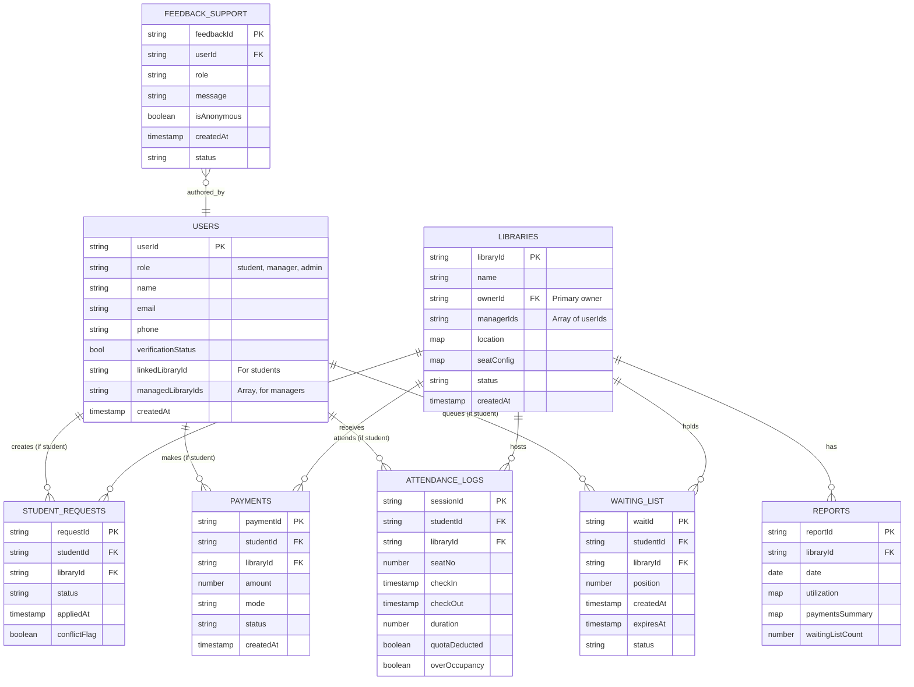

# Firebase Functions — Recommended Folder Structure (TypeScript, modular)

Below is a production-ready, modular folder layout for your Firebase Functions project. I recommend **TypeScript** (better type-safety) and one function entrypoint (`src/index.ts`) that exports all callable / background functions. Each module lives in its own folder and exposes functions through that module. I also include supporting files (config, utils, tests, deployment scripts) and notes on what each file does.

```
functions/                                # root of Firebase Functions
├─ package.json
├─ tsconfig.json
├─ .eslintrc.js
├─ .prettierrc
├─ firebase.json                          # functions hosting config (optional)
├─ .runtimeconfig.json (or use env vars)  # optional local config
├─ src/
│  ├─ index.ts                            # exports all functions
│  ├─ config/
│  │  └─ index.ts                         # typed config loader (process.env or functions.config())
│  ├─ lib/
│  │  ├─ firebaseAdmin.ts                 # initialize admin SDK, export admin, firestore, auth, messaging
│  │  ├─ errors.ts                        # shared error types
│  │  └─ validators.ts                    # helper validation functions
│  ├─ utils/
│  │  ├─ sendNotification.ts              # FCM + email wrapper
│  │  ├─ queue.ts                         # simple FIFO helpers for waiting list logic (optional)
│  │  └─ time.ts                          # timezone helpers, rounding utilities
│  ├─ middleware/
│  │  ├─ authGuard.ts                     # verify callable auth, return role info
│  │  └─ rateLimiter.ts                   # basic throttling for public endpoints
│  ├─ auth/
│  │  ├─ onStudentSignup.ts               # auth.onCreate -> create user doc
│  │  ├─ onUserDelete.ts                  # auth.onDelete -> cleanup docs
│  │  └─ manageClaims.ts                  # admin callable to set custom claims (admin-only)
│  ├─ registration/
│  │  ├─ libraryRegistrationRequest.ts    # http/callable: public request -> write library_registration_requests
│  │  ├─ approveLibrary.ts                # callable by admin to approve & create manager user + claims
│  │  └─ rejectLibrary.ts                 # callable by admin to reject with reason
│  ├─ booking/
│  │  ├─ applyForLibrarySeat.ts           # callable: create student_registration_requests
│  │  ├─ managerApproveSeat.ts            # callable: manager approves student
│  │  ├─ autoAssignSeat.ts                # Firestore trigger or callable for single-seat assignment
│  │  └─ transferSeatOnCheckout.ts        # Firestore trigger: on checkout -> assign waiting list
│  ├─ waiting/
│  │  ├─ addToWaitingList.ts              # helper callable (or used by applyForLibrarySeat)
│  │  ├─ waitingListExpiryHandler.ts      # scheduled cleanup for expired wait entries
│  │  └─ confirmWaitingAssignment.ts      # callable: student confirms assigned seat (30-min window)
│  ├─ attendance/
│  │  ├─ checkInStudent.ts                # callable: create attendance_logs entry
│  │  ├─ checkOutStudent.ts               # callable: close attendance, calculate duration
│  │  ├─ overOccupancyMonitor.ts          # scheduled (every 15 min): detect & handle over-occupancy
│  │  └─ reconcileAttendance.ts           # daily cron: reconcile orphan sessions / quota accounting
│  ├─ payments/
│  │  ├─ recordPayment.ts                 # callable: student posts payment
│  │  ├─ confirmPayment.ts                # callable: manager confirms payment
│  │  └─ paymentCleanup.ts                # scheduled job to notify unconfirmed payments older than X days
│  ├─ reports/
│  │  ├─ dailySeatAllocator.ts            # scheduled 5 AM: pre-allocate seats for day
│  │  ├─ dailyQuotaMonitor.ts             # scheduled midnight: quota warnings
│  │  └─ dailyReportGenerator.ts          # scheduled midnight: generate & store reports
│  ├─ admin/
│  │  ├─ assignVerificationAgent.ts       # admin callable to assign agents to libraries
│  │  └─ auditLogWriter.ts                # wrapper for server-side-only writes to audit_logs
│  ├─ tests/                              # unit/integration tests using emulator
│  │  ├─ booking.test.ts
│  │  └─ attendance.test.ts
│  └─ types/
│     ├─ index.d.ts                       # TS interfaces for Firestore documents
│     └─ enums.ts                         # enums for status strings etc.
├─ scripts/
│  ├─ deploy.sh                           # convenience deploy script (CI friendly)
│  └─ seed-local.js                       # seed emulator with sample data
├─ .firebaserc
└─ README.md
```

---

## File / Folder Purpose (brief)

* **src/index.ts**

  * Central export file. Import functions from each module and export them as `exports.applyForLibrarySeat = ...` (or `export const applyForLibrarySeat = functions.https.onCall(...)`).
* **src/lib/firebaseAdmin.ts**

  * Single initialization of Admin SDK: `admin.initializeApp()`. Export `admin`, `db`, `auth`, `messaging`, making it re-usable across modules.
* **src/config/index.ts**

  * Loads configuration (from `process.env` or `functions.config()`), validates keys and exposes typed config (e.g., `NOTIFICATION_TOPIC_PREFIX`, `TIMEZONE`).
* **src/middleware/authGuard.ts**

  * Checks `context.auth` in callables, pulls custom claims, enforces role restrictions. Reusable for all callables.
* **src/utils/sendNotification.ts**

  * Encapsulates push + email + Firestore notification creation.
* **auth/**

  * Auth triggers: `onCreate` -> create user document; set default role; notify admin for verification.
* **registration/**

  * Public-facing library registration functions and admin approval routines. `approveLibrary.ts` should create manager auth user (Admin SDK) and set custom claims `role: 'manager', managerLibraryIds: [...]`.
* **booking/** & **waiting/** & **attendance/**

  * Core seat allocation and occupancy logic. Keep domain logic here. `autoAssignSeat.ts` should be callable and also triggered by Firestore `onUpdate` when seats free up.
* **reports/**

  * Scheduled jobs (Cloud Scheduler triggers via `functions.pubsub.schedule('every 24 hours')...`) and report generation.
* **admin/**

  * Admin-only helpers (assign verification agents, write audit logs).
* **tests/**

  * Unit tests using `firebase-functions-test` or `@firebase/rules-unit-testing` + Firestore emulator.
* **scripts/**

  * Useful for CI/CD and local dev.

---

## Naming & Trigger Recommendations

* Use **`onCall`** for functions invoked by authenticated mobile apps where auth context must be available.
* Use **`onRequest`** (HTTP) for public webhooks (e.g., payment gateway later).
* Use **Firestore triggers** (`functions.firestore.document('attendance_logs/{id}').onCreate(...)`) for reactive flows like "seat freed → assign waiting list".
* Use **Pub/Sub schedule** for Cron: `functions.pubsub.schedule('every 24 hours').timeZone('Asia/Kolkata').onRun(...);`

---

## TypeScript / Build Notes

* `package.json` scripts:

  ```json
  {
    "scripts": {
      "build": "tsc",
      "serve": "firebase emulators:start --only functions,firestore",
      "deploy": "firebase deploy --only functions",
      "lint": "eslint --ext .ts src",
      "test": "mocha -r ts-node/register src/tests/**/*.test.ts"
    }
  }
  ```
* Keep `tsconfig.json` target to `ES2019` or later.
* Use `eslint` + `prettier`.
* Use `firebase-functions` v3+ and `firebase-admin` latest.

---

## Security & Best Practices (ops notes)

* All admin-only operations must be callable only by users with `role: admin` in custom claims — set securely with Admin SDK.
* Use **custom claims** for role checks in security rules and in authGuard middleware to avoid additional Firestore reads.
* Write **idempotent** functions (especially scheduled jobs) to avoid double-assignments on retries.
* Use Firestore **transactions** or **batched writes** when assigning seats (read availability → assign seat → update waiting_list) to prevent race conditions.
* For long-running work (e.g., heavy analytics), consider pushing tasks to Pub/Sub / Cloud Tasks from Functions to keep execution time under limits.
* Keep audit logs written only from server-side code (admin module).

---

## Example: index.ts (pattern)

```ts
// src/index.ts
import * as functions from 'firebase-functions';
import { onStudentSignup } from './auth/onStudentSignup';
import { libraryRegistrationRequest } from './registration/libraryRegistrationRequest';
import { approveLibrary } from './registration/approveLibrary';
import { applyForLibrarySeat } from './booking/applyForLibrarySeat';
import { checkInStudent } from './attendance/checkInStudent';
import { checkOutStudent } from './attendance/checkOutStudent';
import { dailySeatAllocator } from './reports/dailySeatAllocator';

// Auth triggers
export const authOnCreate = functions.auth.user().onCreate(onStudentSignup);

// HTTP / Callable
export const httpLibraryRegistration = functions.https.onCall(libraryRegistrationRequest);
export const httpApproveLibrary = functions.https.onCall(approveLibrary);
export const httpApplyForSeat = functions.https.onCall(applyForLibrarySeat);
export const httpCheckIn = functions.https.onCall(checkInStudent);
export const httpCheckOut = functions.https.onCall(checkOutStudent);

// Scheduled jobs
export const scheduledDailySeatAllocator = functions.pubsub
  .schedule('0 5 * * *') // 5:00 AM Asia/Kolkata
  .timeZone('Asia/Kolkata')
  .onRun(dailySeatAllocator);
```

---


# Ekaant — ER Diagram & Schema Visualization (v2)

Below is the updated ER-style diagram (Mermaid) of the Firestore schema. This version incorporates feedback to support multiple managers per library and to prepare for managers overseeing multiple libraries in the future.



---

## Notes & Index Recommendations

*   **Composite Indexes**:
    *   `libraries` by `location.pincode` and `status`.
    *   `libraries` by `managerIds` (array-contains query).
    *   `student_requests` composite index: `libraryId, status, appliedAt`.
    *   `waiting_list` composite index: `libraryId, status, createdAt`.
    *   `attendance_logs` composite: `libraryId, checkIn (desc)`.
    *   `payments` composite: `libraryId, status, createdAt`.

*   **TTL / Cleanup:** Use `expiresAt` on `waiting_list` and a scheduled Cloud Function to remove expired entries.

*   **Denormalization Tips:**
    *   Store `studentName`, `studentPhone` inside `student_requests` & `waiting_list` to avoid extra reads when rendering manager dashboards.
    *   Store `libraryName` and `libraryLogoUrl` inside `payments` and `attendance_logs` for quicker reporting.

---

## Sample Document (student user)

```json
{
  "userId": "UID123",
  "role": "student",
  "name": "Sandeep Kumar",
  "email": "sandeep@example.com",
  "phone": "+919999999999",
  "verificationStatus": true,
  "linkedLibraryId": "LIB001",
  "managedLibraryIds": null,
  "createdAt": "2025-11-04T00:00:00Z"
}
```

## Sample Document (manager user)

```json
{
  "userId": "UID999",
  "role": "manager",
  "name": "Aarav Patel",
  "email": "manager@example.com",
  "phone": "+918888888888",
  "verificationStatus": true,
  "linkedLibraryId": null,
  "managedLibraryIds": ["LIB001"],
  "createdAt": "2025-11-01T00:00:00Z"
}
```

## Sample Document (library)

```json
{
  "libraryId": "LIB001",
  "name": "Ranchi Study Hub",
  "ownerId": "UID999",
  "managerIds": ["UID999", "UID998"],
  "location": {"city":"Ranchi","pincode":"834001","mapUrl":"..."},
  "seatConfig": {"totalSeats":50,"slots":[{"slotType":"4hr","price":40}]},
  "status":"approved",
  "createdAt":"2025-11-01T00:00:00Z"
}
```

---
